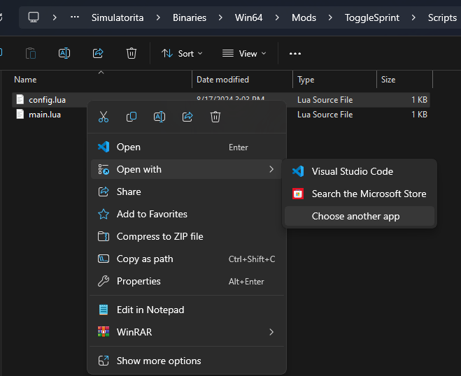
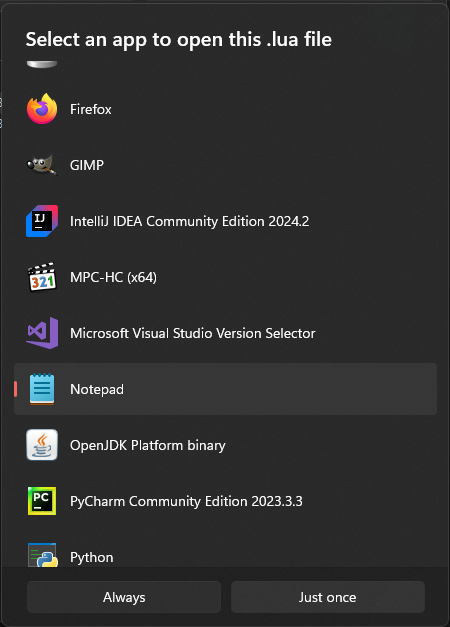

# Configuring mods
This guide will tell you how to configure installed mods.

## Editing the config file
Select a configurable mod from your `Mods` folder and go into it.  
In the folder of that mod you should see a folder named `Scripts`, open it.
You should see a `config.lua` file if you selected a configurable mod.  
Open the `config.lua` file using notepad.

> [!TIP]
> On Windows 11 you should see an `Edit in Notepad` option after right-clicking. You can click it to make the process easier.

> [!NOTE]
> To enable file extensions go to `View > Show > File name extensions` (Windows 11)



Right-click the `config.lua` file and select the option `Open with`.  
If you see notepad click it



Select notepad on the list, if it doesn't appear select the `Choose an app on your PC`.  
Go to the path `C:\Windows\System32\` and select `notepad.exe` there.

After you've opened the `config.lua` file, you should see something like this:
```lua
local config = {
    -- Amount of cash to add when keybind is pressed
    add_cash_amount = 36.34,
    -- Key that needs to be pressed with the modifier keys to trigger the money addition
    key = Key.F1,
    -- Modifier keys that need to be pressed with the key to trigger the money addition
    modifier_keys = { ModifierKey.CONTROL }
}
return config
```
I'm using the config of MoneyAdder as an example. Config highly depends on the mod you're using

Look for equal signs. Comments above equal signs should explain what changing the config option does.
In this example I want to change the amount of cash added to `107.38`, the key to caps lock and no modifier keys.
To do that I changed:  
```lua
local config = {
    -- Amount of cash to add when keybind is pressed
    add_cash_amount = 36.34, -- [!code --]
    add_cash_amount = 107.38, -- [!code ++]
    -- Key that needs to be pressed with the modifier keys to trigger the money addition
    key = Key.F1, -- [!code --]
    key = Key.CAPS_LOCK, -- [!code ++]
    -- Modifier keys that need to be pressed with the key to trigger the money addition
    modifier_keys = { ModifierKey.CONTROL } -- [!code --]
    modifier_keys = {} -- [!code ++]
}
return config
```
To save, press `Ctrl+S` in notepad, and you can now close it.

> [!TIP]
> `modifier_keys` is kind of a list in this example, you can store any amount of elements in a list.
> If you would want to press all modifier keys at once to trigger the event you would type:
> ```lua
> modifier_keys = { ModifierKey.CONTROL, ModifierKey.ALT, ModifierKey.SHIFT }
> ```

> [!TIP]
> You can reload mods and configs without reopening the game. How hot reload guide is [here](../misc/hot-reloading.md)

> [!TIP]
> All type variations for `Key` and `ModifierKey` are [here](../misc/config-types.md)
