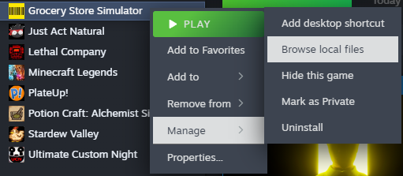

# Installing mods
This guide will tell you how to install mod loader and mods for Grocery Store Simulator.

## Mod loader installation
Download [UE4SS from its GitHub page](https://github.com/UE4SS-RE/RE-UE4SS/releases/latest).  
You will want to download `UE4SS_VERSION.zip` or `zDEV-UE4SS_VERSION.zip` if you plan to make mods for Grocery Store Simulator.  
After downloading, find Grocery Store Simulator's game folder by right-clicking Grocery Store Simulator in Steam and going into `Manage > Browse local files`

In the newly opened folder go to `Simulatorita/Binaries/Win64`.  
Extract the zip contents from previously downloaded zip file to that folder.

> [!NOTE]
> If you downloaded the zDEV version additional 2 windows may pop up. You can ignore them.

## Mod installation
Download a mod from [NexusMods](https://nexusmods.com/grocerystoresimulator) or any source you trust.  
Go to the `Grocery Store Simulator/Simulatorita/Binaries/Win64/Mods` folder.  
Extract the contents from the mod's zip to that folder.  
Open the `mods.txt` file and add `[MODNAME] : 1` at the end of the file to enable that mod
> [!WARNING]
> `[MODNAME]` should be the name of the folder in the zip file.

