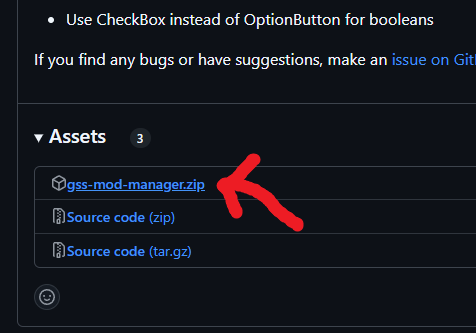

# Installing mods
This guide will tell you how to install mod loader and mods for Grocery Store Simulator.
If you want to develop mods for this game, consider using the [manual guide](#manual-mod-loader-installation)

## Using GSS Mod Manager
The easiest way to mod this game is to use GSS Mod Manager.
A video guide how to use it is [here](https://youtu.be/LgSaEsA-7F8).

First, download GSS Mod Manager from [GitHub](https://github.com/nieboczek/gss-mod-manager/releases/latest).  

Extract it somewhere on your computer. From that folder, run `gss-mod-manager.exe`.  
If you get a pop-up of type "Windows protected your PC", click More info and Run anyways.
That pop-up means that the file hasn't been downloaded enough times for Windows to trust it.  

After opening GSS Mod Manager, it should automatically detect the path to Grocery Store Simulator.  
Then, you can click the Install mod loader button to install the mod loader.  
After installing the mod loader, download some mods from [NexusMods](https://nexusmods.com/grocerystoresimulator).  
Now, open GSS Mod Manager again (if you closed it) and click the Install mod button.
It will open a dialog asking which file to open, open the mod .zip files.
The mods should be automatically installed.

You can now toggle them, delete them and [configure them](configuring-mods.md).

## Manual mod loader installation
Download [UE4SS from its GitHub page](https://github.com/UE4SS-RE/RE-UE4SS/releases/latest).  
You will want to download `UE4SS_VERSION.zip` or `zDEV-UE4SS_VERSION.zip` if you plan to make mods for Grocery Store Simulator.  
After downloading, find Grocery Store Simulator's game folder by right-clicking Grocery Store Simulator in Steam and going into `Manage > Browse local files`

In the newly opened folder go to `Simulatorita/Binaries/Win64`.  
Extract the zip contents from previously downloaded zip file to that folder.

> [!WARNING]
> Do not extract the zip contents to a subfolder. Zip contents should be in `Grocery Store Simulator/Simulatorita/Binaries/Win64`.

> [!NOTE]
> If you downloaded the zDEV version additional 2 windows may pop up. You can ignore them.

## Lua mod installation
Most mods are Lua mods, if the creator mentioned that the mod is a blueprint mod, use [the below Blueprint mod installation guide](#blueprint-mod-installation) instead.

Download a Lua mod from [NexusMods](https://nexusmods.com/grocerystoresimulator) or any source you trust.  
Go to the `Grocery Store Simulator/Simulatorita/Binaries/Win64/Mods` folder.
Extract the contents from the mod's zip to that folder.  
Open the `mods.txt` file and add `MOD_NAME : 1` at the end of the file to enable that mod

> [!WARNING]
> `MOD_NAME` should be the name of the folder in the zip file.

## Blueprint mod installation
Download a blueprint mod from [NexusMods](https://nexusmods.com/grocerystoresimulator) or any source you trust.  
Go to the `Grocery Store Simulator/Simulatorita/Content/Paks/LogicMods` folder.
Extract the contents from the mod's zip to that folder.  
The mod will be ran automatically after starting the game.
