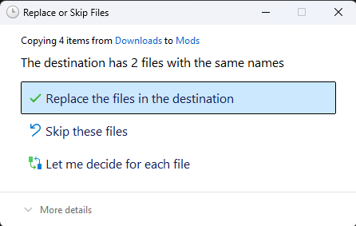

# Updating mods
This guide will tell you how to update mods and keeping your config

## Using GSS Mod Manager
Download the new version from [NexusMods](https://nexusmods.com/grocerystoresimulator).
Click the Install mod button in GSS Mod Manager and edit the config to your needs.

## Installing new mod version
Download the update from where you got the mod.  
Go to the `Grocery Store Simulator/Simulatorita/Binaries/Win64/Mods` folder.

If you want to keep your config, go to mod's folder, go to `Scripts` and move `config.lua` from there to somewhere safe.

> [!WARNING]
> The new version of the mod may have changed the config. The developer should notify when config was changed.

Extract the contents from the new version's zip to `Mods`.
You should see a pop up. Press `Replace the files in the destination`.

If you moved your old config to somewhere, now move it back into the mod's folder and `Scripts`.
