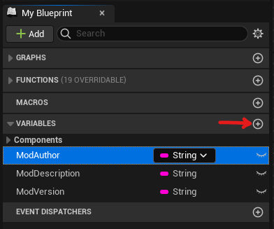
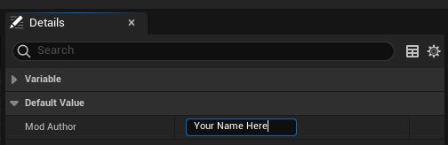
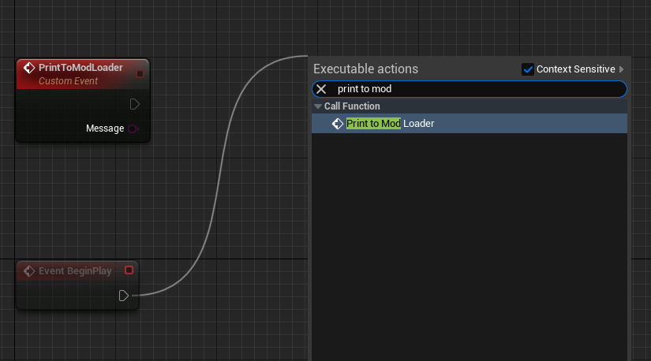

# Blueprint Setup
This guide will tell you how to setup Unreal Engine for modding with blueprints.

## Setting up The Project
Install [Unreal Engine 5.2](https://www.unrealengine.com/download).
> [!WARNING]
> You **MUST** use Unreal 5.2 as it is what the game runs on.

Create a blank project named `Simulatorita`.

Go to `Edit > Project Settings > Packaging`, and ensure you have the following settings.

<!-- Probably Redundant due to screenshot -->
<!-- | Setting                    | State    |
|----------------------------|----------|
| Use Pak File               | Enabled  |
| Use to Store               | Enabled  |
| Generate Chunks            | Enabled  |
| Share Material Shader Code | Disabled |
| Allow ChunkID assignmnets  | Enabled  | -->

Then, go to `Edit > Editor Preferences` and search for `Allow ChunkID assignmnets`

In the `Content Browser`, create a new folder called `Mods`.
Then, create your mod folder and call it whatever you like, such as `MyMod`.

Right-click and create a new `Blueprint Class`.

Choose the `Actor` class.

Once the Blueprint is created, name it `ModActor`.

Open your ModActor's `Event Graph` and create 3 `String` Variables.

Click to `Compile` your blueprint and then you can edit each Variable.

Each value can be changed under `Default Value`.

Right-click and add a `Custom Event`.

Name it `PrintToModLoader`, add a `String` input titled `Message`.

Drag off of the `Event Begin Play` node and search for `PrintToModLoader`.

In the message input type: `Mod Loaded!`.

Make sure to `Compile` your blueprint and then save your `Mod Actor`.

Now you can build your mod!  
Check out [the building guide](/blueprint-modding/building-mods).

> [!NOTE]
> Some information and screenshots taken from [Dmgvol's UE Modding Guide](https://github.com/Dmgvol/UE_Modding/)
