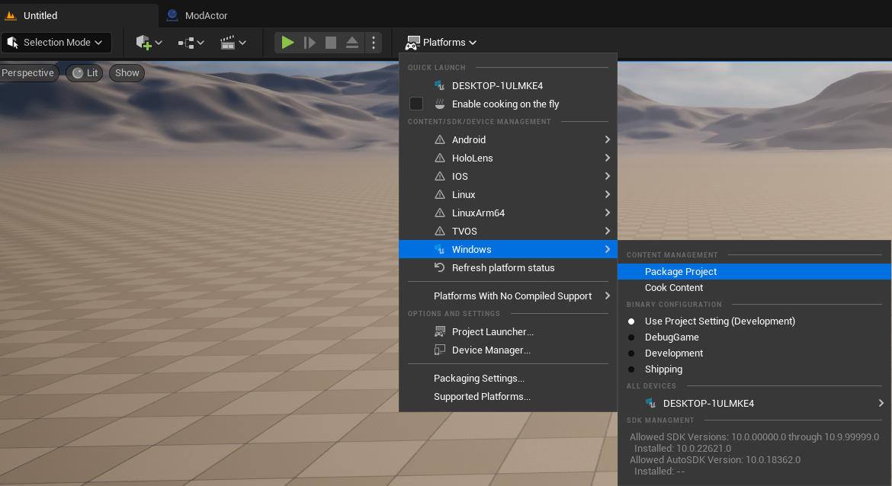
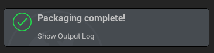

# Packaging mods
This guide will tell you how to package your mod using Unreal Engine 5.

## Packaging in Unreal Engine
Open your project and go to the scene you started with. Select `Platforms > Windows > Package Project`. Select the folder where you want your project to be packaged.

> [!NOTE]
> Packaging may take from 5 minutes to 10 seconds depending on the hardware of your computer. If you're packaging the first time it may take longer.

After packaging is completed, you should see an indicator in the bottom-right corner.

## Testing your mod
Go to the folder where you wanted your projected to be packaged.
In that folder go to `Windows/Simulatorita/Content/Paks`.  
You should see three `pakchunk1-Windows` files with different extensions.
Rename all of them to the name of your mod, keep the extensions.

> [!WARNING]
> The file names should have the same name as your mod's folder in Unreal Engine

Move the mod files into `Grocery Store Simulator/Simulatorita/Content/Paks/LogicMods/`.
When you start the game, the mod loader will automatically load the mods.

> [!NOTE]
> When distributing your mod, please mention that it's a blueprint mod.

> [!NOTE]
> Some information and screenshots taken from [Dmgvol's UE Modding Guide](https://github.com/Dmgvol/UE_Modding/)
