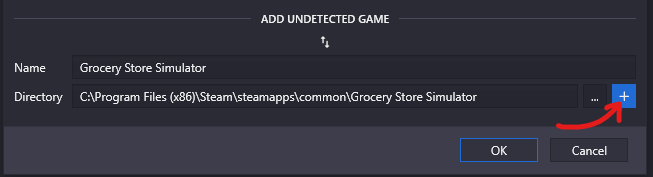

# Searching game files
This guide will tell you how to search game files using FModel.

## Installing FModel
Install [FModel](https://fmodel.app/).

Start Grocery Store Simulator and open the UE4SS GUI console.
Under the `Dumpers` tab, click `Generate .usmap file`.

Then you can open FModel and click the arrow to `Add Undetected Game`.
Set the filepath to `Grocery Store Simulator/` and press the plus to add the game.
Then, select `GAME_UE5_2 (536870944)` from the UE Versions drop down.

> [!NOTE]
> If you already have FModel installed, you will have to select `Directory` and `Selector` at the top of the window.

Open the settings at the top of the window and enable `Local Mapping File`.
Set the `Mapping File Path` to `Grocery Store Simulator/Binaries/Win64/Mappings.usmap`

## Audio
If you want to be able to preview audio files from the game, you will need to install the [Bink Audio Tool](https://github.com/Keisawaakira/BinkadecWithWavHeader) for FModel.

To install, download the latest release and extract the files to `FModel/Output/.data/`.

Now you should be able to search through the game files!
- Game files are in `Simulatorita-Windows.utoc`
- Translations are in `Simulatorita-Windows.pak`
